# Comprehensive Data Visualization Using Matplotlib

 

Welcome to the Comprehensive Data Visualization project using Matplotlib! This repository provides a thorough guide to creating and customizing various types of plots, ranging from basic visualizations to advanced plotting techniques, using the Matplotlib library in Python. This project is ideal for both beginners in data science and experienced analysts looking to enhance their data visualization skills.

## Table of Contents

- [Introduction](#introduction)
- [Folder Structure](#folder-structure)
- [Visualization Techniques](#visualization-techniques)
  - [1. Line Plot](#1-line-plot)
  - [2. Bar Plot](#2-bar-plot)
  - [3. Scatter Plot](#3-scatter-plot)
  - [4. Histogram](#4-histogram)
  - [5. Box Plot](#5-box-plot)
  - [6. Violin Plot](#6-violin-plot)
  - [7. Pie Chart](#7-pie-chart)
  - [8. Heatmap](#8-heatmap)
  - [9. Contour Plot](#9-contour-plot)
  - [10. Pair Plot](#10-pair-plot)
  - [11. Custom Figure](#11-custom-figure)
  - [12. 3D Plot](#12-3d-plot)
- [Case Study](#case-study)
- [Comprehensive Project](#comprehensive-project)
- [Conclusion](#conclusion)
- [How to Use](#how-to-use)

## Introduction

Data visualization is an essential skill in data science, enabling you to interpret complex datasets and derive meaningful insights through graphical representations. This project demonstrates a variety of visualization techniques using Matplotlib, a versatile and widely-used plotting library in Python.

## Folder Structure

The repository is organized into several folders, each containing scripts, datasets, and plots related to specific visualization techniques.

## Visualization Techniques

### 1. Line Plot

Line plots are used to visualize trends over time or continuous data.

**Use Case:** Ideal for displaying time series data, such as stock prices or temperature changes over time.

**Syntax:**
```python
plt.plot(x, y)
plt.xlabel('X-axis Label')
plt.ylabel('Y-axis Label')
plt.title('Line Plot')
plt.show()
```

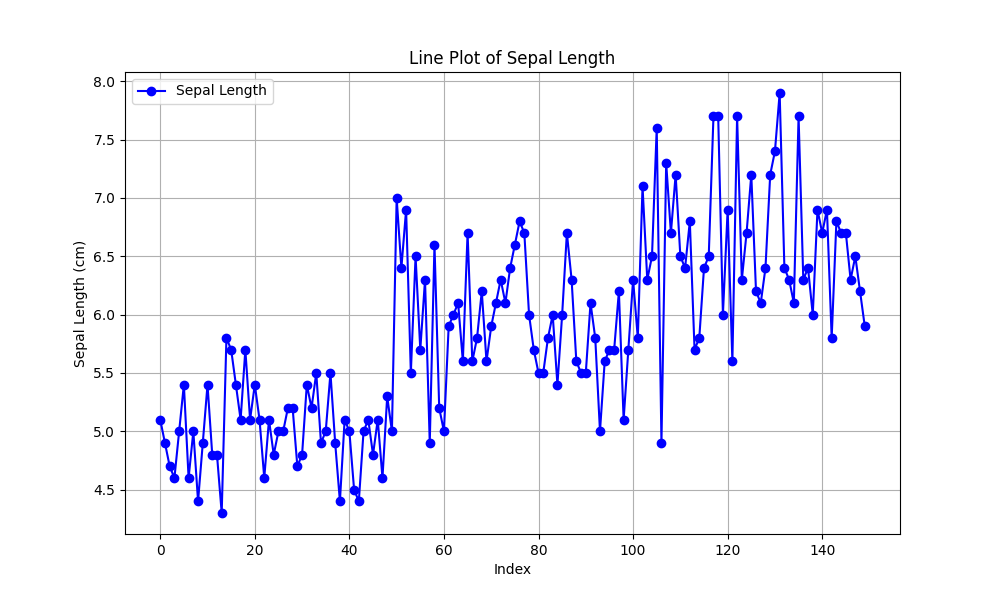

### 2. Bar Plot

Bar plots are ideal for comparing quantities across different categories.

**Use Case:** Useful for comparing sales figures across different products or categories.

**Syntax:**
```python
plt.bar(categories, values)
plt.xlabel('Categories')
plt.ylabel('Values')
plt.title('Bar Plot')
plt.show()
```

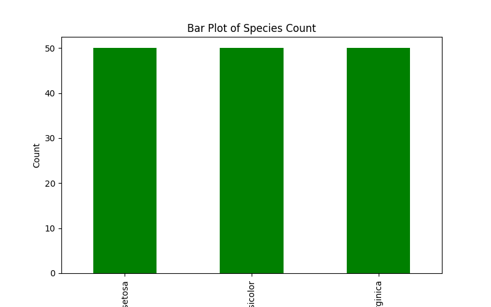

### 3. Scatter Plot

Scatter plots are used to visualize the relationship between two variables.

**Use Case:** Perfect for showing correlations between variables, like height vs. weight.

**Syntax:**
```python
plt.scatter(x, y)
plt.xlabel('X-axis Label')
plt.ylabel('Y-axis Label')
plt.title('Scatter Plot')
plt.show()
```

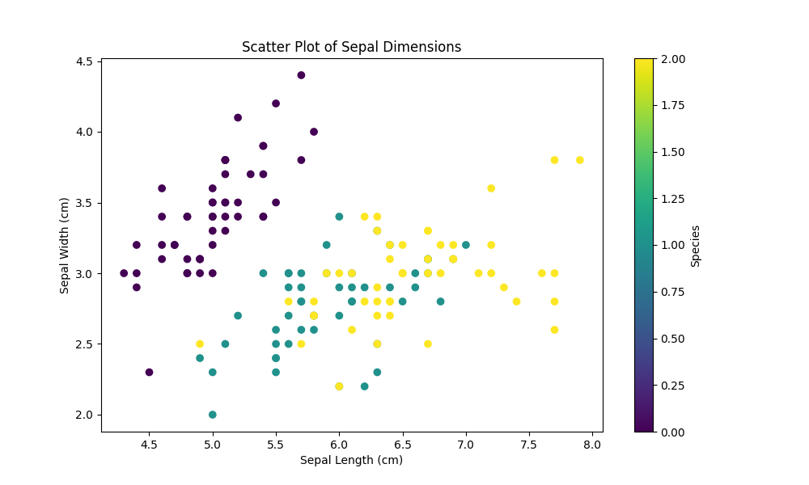

### 4. Histogram

Histograms display the distribution of a dataset.

**Use Case:** Ideal for understanding the frequency distribution of a dataset, such as age distribution in a population.

**Syntax:**
```python
plt.hist(data, bins=10)
plt.xlabel('Data')
plt.ylabel('Frequency')
plt.title('Histogram')
plt.show()
```

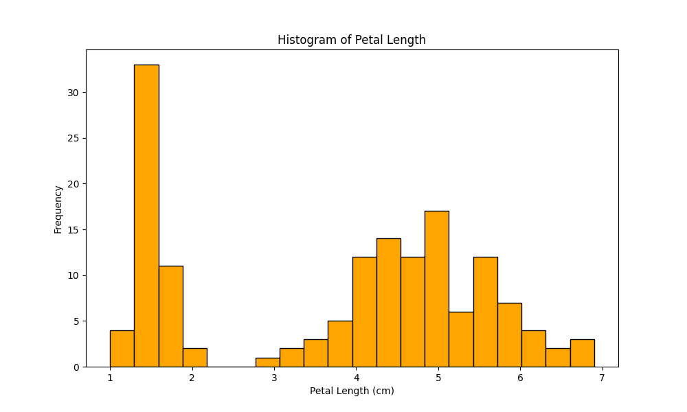

### 5. Box Plot

Box plots summarize the distribution of a dataset by showing its quartiles.

**Use Case:** Useful for identifying outliers and understanding the spread of data.

**Syntax:**
```python
plt.boxplot(data)
plt.title('Box Plot')
plt.show()
```

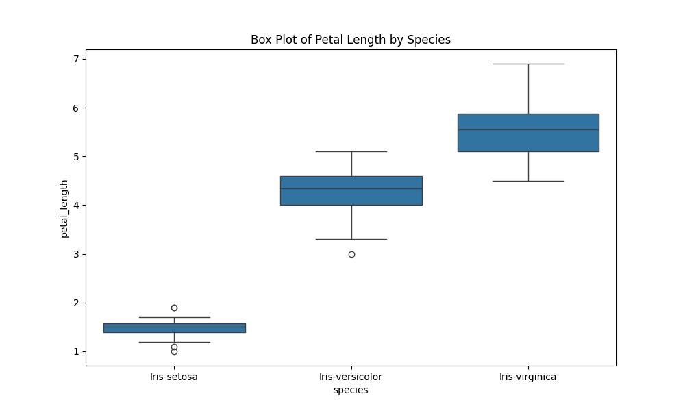

### 6. Violin Plot

Violin plots combine the properties of box plots and kernel density estimates to display the distribution of data.

**Use Case:** Ideal for comparing the distribution of data across different categories.

**Syntax:**
```python
plt.violinplot(data)
plt.title('Violin Plot')
plt.show()
```

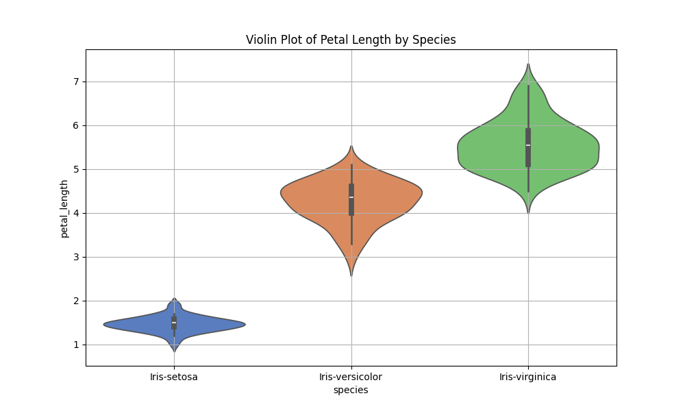

### 7. Pie Chart

Pie charts show the proportions of categories in a dataset.

**Use Case:** Useful for showing the percentage distribution of different categories, like market share.

**Syntax:**
```python
plt.pie(sizes, labels=labels, autopct='%1.1f%%')
plt.title('Pie Chart')
plt.show()
```

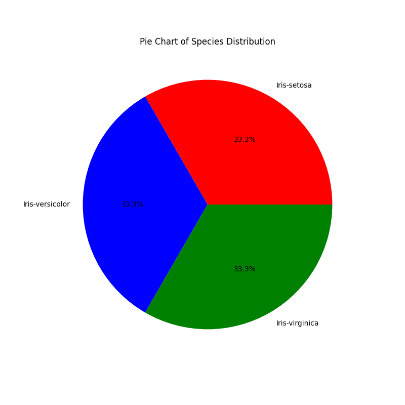

### 8. Heatmap

Heatmaps are used to visualize matrix-like data or the relationships between variables.

**Use Case:** Perfect for visualizing correlations in a dataset or displaying matrix data.

**Syntax:**
```python
sns.heatmap(data, annot=True)
plt.title('Heatmap')
plt.show()
```

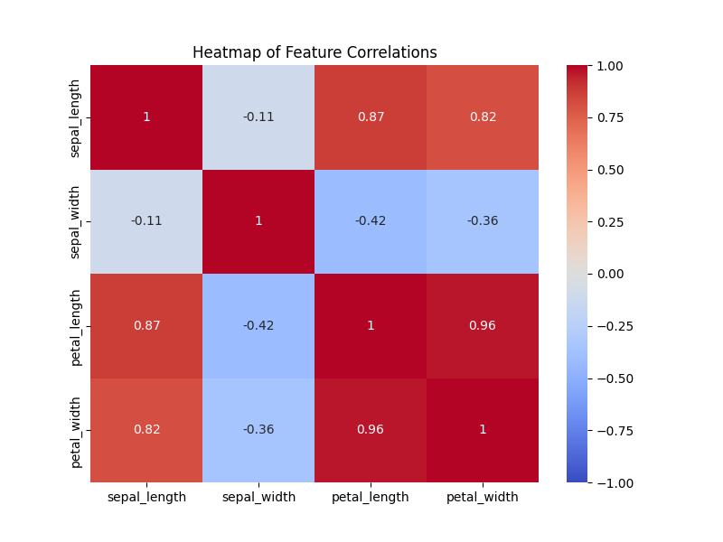

### 9. Contour Plot

Contour plots represent three-dimensional data in two dimensions using contour lines.

**Use Case:** Useful for visualizing the topography or intensity of values in a dataset.

**Syntax:**
```python
plt.contour(X, Y, Z)
plt.title('Contour Plot')
plt.show()
```

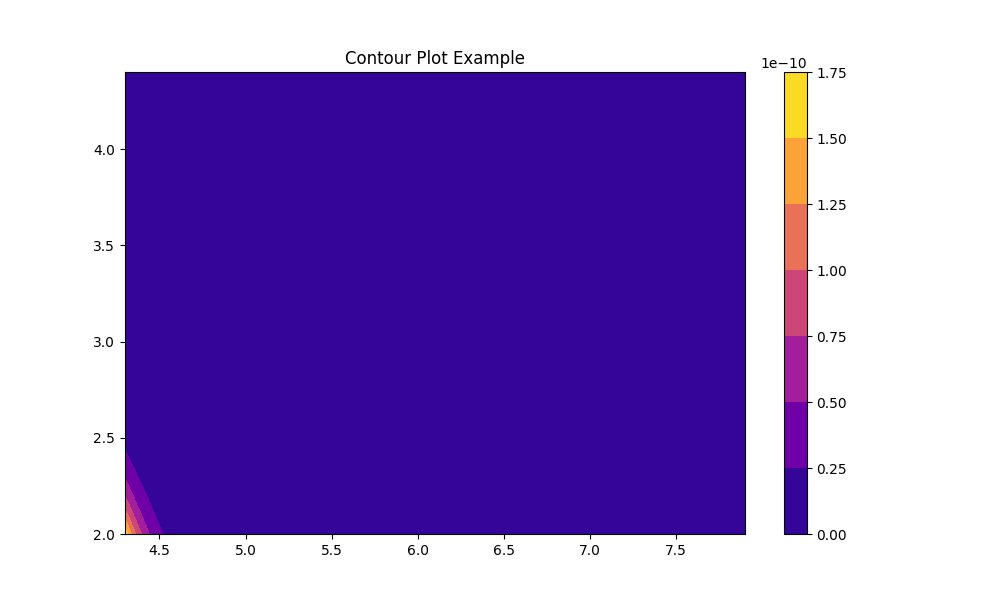

### 10. Pair Plot

Pair plots are used to visualize relationships between pairs of variables in a dataset.

**Use Case:** Ideal for exploring pairwise relationships in a dataset with multiple variables.

**Syntax:**
```python
sns.pairplot(data)
plt.title('Pair Plot')
plt.show()
```

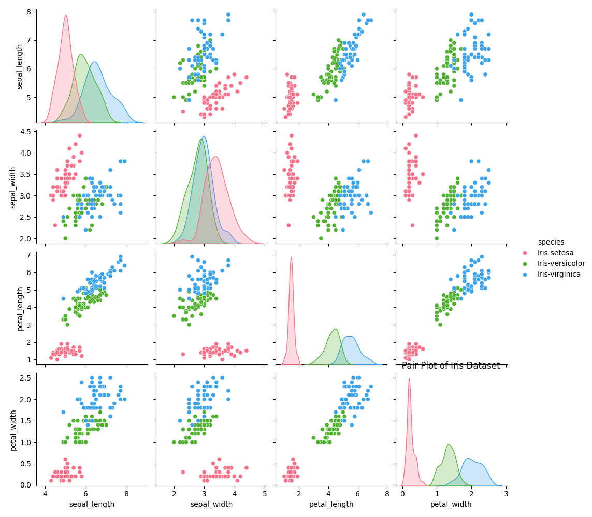

### 11. Custom Figure

Custom figures allow for the creation of more complex and tailored visualizations.

**Use Case:** Useful when you need multiple subplots or a unique layout.

**Syntax:**
```python
fig, axs = plt.subplots(2, 2)
axs[0, 0].plot(x, y)
axs[0, 1].bar(categories, values)
axs[1, 0].scatter(x, y)
axs[1, 1].hist(data)
plt.suptitle('Custom Figure')
plt.show()
```

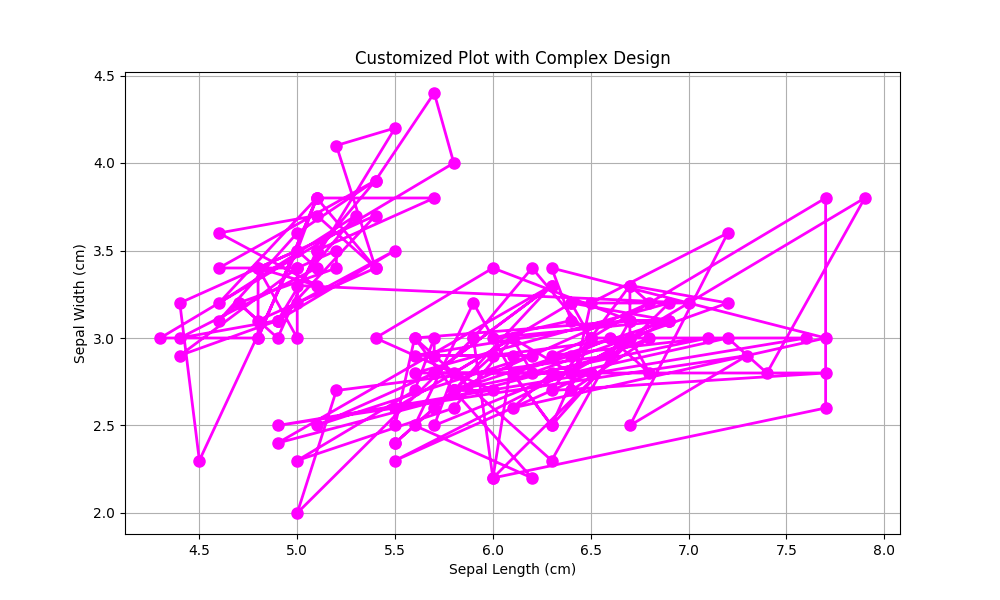

### 12. 3D Plot

3D plots provide a three-dimensional view of data, offering deeper insights into its structure.

**Use Case:** Ideal for visualizing relationships in datasets with three variables.

**Syntax:**
```python
fig = plt.figure()
ax = fig.add_subplot(111, projection='3d')
ax.plot_surface(X, Y, Z)
plt.title('3D Plot')
plt.show()
```

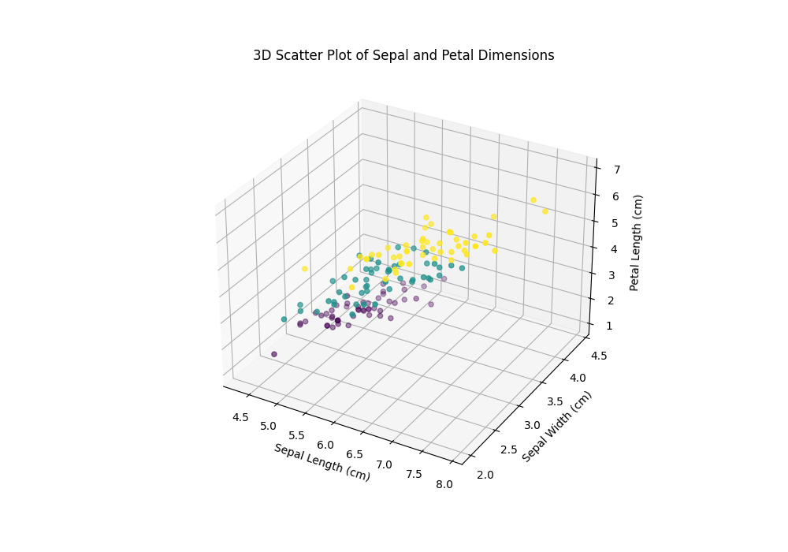

## Case Study

The repository also includes a case study that demonstrates the practical application of these visualization techniques on a real-world dataset.

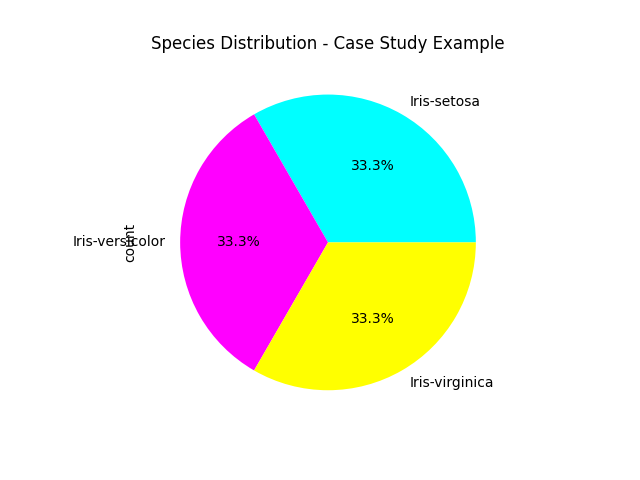

## Comprehensive Project

Finally, a comprehensive project is provided that integrates multiple visualization techniques to analyze and present data in a coherent and insightful manner.

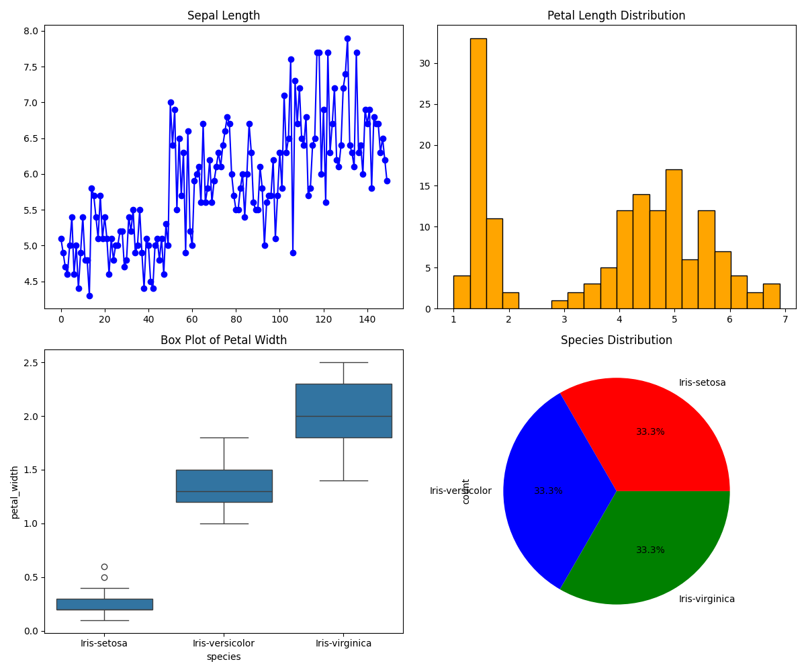

## Conclusion

This repository offers a complete guide to mastering data visualization using Matplotlib. By following the examples and exploring the provided scripts, you will be able to create and customize a wide variety of plots, enabling you to effectively communicate your data insights.

## How to Use

To get started with the scripts in this repository, ensure you have Python installed along with the required libraries. You can install the necessary packages using the following command:

```bash
pip install -r requirements.txt
```
